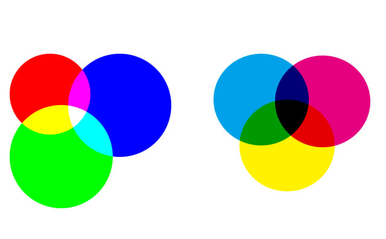

Last Modify : 2018-08-12 13：47
- [1.色彩](#1%E8%89%B2%E5%BD%A9)
    - [1.1.三原色](#11%E4%B8%89%E5%8E%9F%E8%89%B2)
        - [1.1.1.`HSB` ~ 基于人眼](#111hsb--%E5%9F%BA%E4%BA%8E%E4%BA%BA%E7%9C%BC)
        - [1.1.2.`RGB` ~ 光的三原色](#112rgb--%E5%85%89%E7%9A%84%E4%B8%89%E5%8E%9F%E8%89%B2)
        - [1.1.3.`CMYK` ~ 印刷色](#113cmyk--%E5%8D%B0%E5%88%B7%E8%89%B2)
        - [1.1.4. `LAB` ~ 大自然](#114-lab--%E5%A4%A7%E8%87%AA%E7%84%B6)
        - [扩展：做印刷文档时，`RGB`与`CMYK`转换](#%E6%89%A9%E5%B1%95%EF%BC%9A%E5%81%9A%E5%8D%B0%E5%88%B7%E6%96%87%E6%A1%A3%E6%97%B6%EF%BC%8Crgb%E4%B8%8Ecmyk%E8%BD%AC%E6%8D%A2)
    - [1.2.分辨率](#12%E5%88%86%E8%BE%A8%E7%8E%87)
        - [1.2.1 图片分辨率](#121-%E5%9B%BE%E7%89%87%E5%88%86%E8%BE%A8%E7%8E%87)
        - [1.2.2 改变分辨率](#122-%E6%94%B9%E5%8F%98%E5%88%86%E8%BE%A8%E7%8E%87)
    - [1.3 绘画与修饰工具](#13-%E7%BB%98%E7%94%BB%E4%B8%8E%E4%BF%AE%E9%A5%B0%E5%B7%A5%E5%85%B7)
    - [1.4 图层混合模式（27种-六大类）](#14-%E5%9B%BE%E5%B1%82%E6%B7%B7%E5%90%88%E6%A8%A1%E5%BC%8F%EF%BC%8827%E7%A7%8D-%E5%85%AD%E5%A4%A7%E7%B1%BB%EF%BC%89)
        - [1.4.1 组合模式（需要降低图层不透明度才产生影响）](#141-%E7%BB%84%E5%90%88%E6%A8%A1%E5%BC%8F%EF%BC%88%E9%9C%80%E8%A6%81%E9%99%8D%E4%BD%8E%E5%9B%BE%E5%B1%82%E4%B8%8D%E9%80%8F%E6%98%8E%E5%BA%A6%E6%89%8D%E4%BA%A7%E7%94%9F%E5%BD%B1%E5%93%8D%EF%BC%89)
        - [1.4.2 加深模式（可使图像变暗）](#142-%E5%8A%A0%E6%B7%B1%E6%A8%A1%E5%BC%8F%EF%BC%88%E5%8F%AF%E4%BD%BF%E5%9B%BE%E5%83%8F%E5%8F%98%E6%9A%97%EF%BC%89)
        - [1.4.3 减淡模式（可使图像变亮，图像中的黑色会被较亮的像素替换，比黑色亮的像素可能加亮底层图像 ）](#143-%E5%87%8F%E6%B7%A1%E6%A8%A1%E5%BC%8F%EF%BC%88%E5%8F%AF%E4%BD%BF%E5%9B%BE%E5%83%8F%E5%8F%98%E4%BA%AE%EF%BC%8C%E5%9B%BE%E5%83%8F%E4%B8%AD%E7%9A%84%E9%BB%91%E8%89%B2%E4%BC%9A%E8%A2%AB%E8%BE%83%E4%BA%AE%E7%9A%84%E5%83%8F%E7%B4%A0%E6%9B%BF%E6%8D%A2%EF%BC%8C%E6%AF%94%E9%BB%91%E8%89%B2%E4%BA%AE%E7%9A%84%E5%83%8F%E7%B4%A0%E5%8F%AF%E8%83%BD%E5%8A%A0%E4%BA%AE%E5%BA%95%E5%B1%82%E5%9B%BE%E5%83%8F-%EF%BC%89)
        - [1.4.4 对比模式（增强图像的反差，混色时，50%的灰色完全消失，任何亮度值高于50%灰色的像素灰都有可能加亮底层的图像，亮度值低于50%灰色的像素则可能使底层图像变暗）](#144-%E5%AF%B9%E6%AF%94%E6%A8%A1%E5%BC%8F%EF%BC%88%E5%A2%9E%E5%BC%BA%E5%9B%BE%E5%83%8F%E7%9A%84%E5%8F%8D%E5%B7%AE%EF%BC%8C%E6%B7%B7%E8%89%B2%E6%97%B6%EF%BC%8C50%E7%9A%84%E7%81%B0%E8%89%B2%E5%AE%8C%E5%85%A8%E6%B6%88%E5%A4%B1%EF%BC%8C%E4%BB%BB%E4%BD%95%E4%BA%AE%E5%BA%A6%E5%80%BC%E9%AB%98%E4%BA%8E50%E7%81%B0%E8%89%B2%E7%9A%84%E5%83%8F%E7%B4%A0%E7%81%B0%E9%83%BD%E6%9C%89%E5%8F%AF%E8%83%BD%E5%8A%A0%E4%BA%AE%E5%BA%95%E5%B1%82%E7%9A%84%E5%9B%BE%E5%83%8F%EF%BC%8C%E4%BA%AE%E5%BA%A6%E5%80%BC%E4%BD%8E%E4%BA%8E50%E7%81%B0%E8%89%B2%E7%9A%84%E5%83%8F%E7%B4%A0%E5%88%99%E5%8F%AF%E8%83%BD%E4%BD%BF%E5%BA%95%E5%B1%82%E5%9B%BE%E5%83%8F%E5%8F%98%E6%9A%97%EF%BC%89)
        - [1.4.5 比较模式（比较两个图层，相同的区域显示为黑色，不同的区域显示为灰色层次或彩色，如果当前图层中包含白色，白色的区域会使底层图像反相，而黑色不会对底层图像产生影响。）](#145-%E6%AF%94%E8%BE%83%E6%A8%A1%E5%BC%8F%EF%BC%88%E6%AF%94%E8%BE%83%E4%B8%A4%E4%B8%AA%E5%9B%BE%E5%B1%82%EF%BC%8C%E7%9B%B8%E5%90%8C%E7%9A%84%E5%8C%BA%E5%9F%9F%E6%98%BE%E7%A4%BA%E4%B8%BA%E9%BB%91%E8%89%B2%EF%BC%8C%E4%B8%8D%E5%90%8C%E7%9A%84%E5%8C%BA%E5%9F%9F%E6%98%BE%E7%A4%BA%E4%B8%BA%E7%81%B0%E8%89%B2%E5%B1%82%E6%AC%A1%E6%88%96%E5%BD%A9%E8%89%B2%EF%BC%8C%E5%A6%82%E6%9E%9C%E5%BD%93%E5%89%8D%E5%9B%BE%E5%B1%82%E4%B8%AD%E5%8C%85%E5%90%AB%E7%99%BD%E8%89%B2%EF%BC%8C%E7%99%BD%E8%89%B2%E7%9A%84%E5%8C%BA%E5%9F%9F%E4%BC%9A%E4%BD%BF%E5%BA%95%E5%B1%82%E5%9B%BE%E5%83%8F%E5%8F%8D%E7%9B%B8%EF%BC%8C%E8%80%8C%E9%BB%91%E8%89%B2%E4%B8%8D%E4%BC%9A%E5%AF%B9%E5%BA%95%E5%B1%82%E5%9B%BE%E5%83%8F%E4%BA%A7%E7%94%9F%E5%BD%B1%E5%93%8D%E3%80%82%EF%BC%89)
        - [1.4.6 色彩模式（色彩分为色相、饱和度、亮度，再将其中的一种或两种应用在混合后的图像中）](#146-%E8%89%B2%E5%BD%A9%E6%A8%A1%E5%BC%8F%EF%BC%88%E8%89%B2%E5%BD%A9%E5%88%86%E4%B8%BA%E8%89%B2%E7%9B%B8%E3%80%81%E9%A5%B1%E5%92%8C%E5%BA%A6%E3%80%81%E4%BA%AE%E5%BA%A6%EF%BC%8C%E5%86%8D%E5%B0%86%E5%85%B6%E4%B8%AD%E7%9A%84%E4%B8%80%E7%A7%8D%E6%88%96%E4%B8%A4%E7%A7%8D%E5%BA%94%E7%94%A8%E5%9C%A8%E6%B7%B7%E5%90%88%E5%90%8E%E7%9A%84%E5%9B%BE%E5%83%8F%E4%B8%AD%EF%BC%89)
    - [1.5 通道（记录颜色信息，，只有三类颜色：黑白灰）](#15-%E9%80%9A%E9%81%93%EF%BC%88%E8%AE%B0%E5%BD%95%E9%A2%9C%E8%89%B2%E4%BF%A1%E6%81%AF%EF%BC%8C%EF%BC%8C%E5%8F%AA%E6%9C%89%E4%B8%89%E7%B1%BB%E9%A2%9C%E8%89%B2%EF%BC%9A%E9%BB%91%E7%99%BD%E7%81%B0%EF%BC%89)
        - [1.5.1 颜色通道~RGB （白色要喷，黑色不喷墨）](#151-%E9%A2%9C%E8%89%B2%E9%80%9A%E9%81%93rgb-%EF%BC%88%E7%99%BD%E8%89%B2%E8%A6%81%E5%96%B7%EF%BC%8C%E9%BB%91%E8%89%B2%E4%B8%8D%E5%96%B7%E5%A2%A8%EF%BC%89)
        - [1.5.2 CMYK通道 （白色不喷，黑色、灰色要喷墨）](#152-cmyk%E9%80%9A%E9%81%93-%EF%BC%88%E7%99%BD%E8%89%B2%E4%B8%8D%E5%96%B7%EF%BC%8C%E9%BB%91%E8%89%B2%E3%80%81%E7%81%B0%E8%89%B2%E8%A6%81%E5%96%B7%E5%A2%A8%EF%BC%89)
        - [1.5.3 专色通道 （专有颜色）](#153-%E4%B8%93%E8%89%B2%E9%80%9A%E9%81%93-%EF%BC%88%E4%B8%93%E6%9C%89%E9%A2%9C%E8%89%B2%EF%BC%89)

# 1.色彩

## 1.1.三原色

### 1.1.1.`HSB` ~ 基于人眼

色相 `H`

饱和度 `S`

亮度 `B`

###  1.1.2.`RGB` ~ 光的三原色

`red`：`255. 0. 0`

`green`：`0. 255. 0`

`blue`：`0. 0. 255`

`white`：`255. 255. 255`

`black`：`0. 0. 0`

`中性灰`：`128. 128. 128`（当所有数值一样，无色相，灰度，深灰浅灰区别）

### 1.1.3.`CMYK` ~ 印刷色

青`（c） `, 按 `%` 划分，

品红`（M）`

黄`（Y）`

配不出`100%`的黑，另配黑（K）色燃料

`黑色`：`C:0 M:0 Y:0 K:100%`

`RGB`为加色模式：

`R+G=Y`

`R+B=M`

`G+B=C`

`R+G+B=WHITE`

`当红光照在白墙上，墙会变红`

`当绿灯照在白墙上，墙会变绿`

`当蓝灯照在白墙上，墙会变蓝`

`当红光和绿光交集照在白墙上，交集处会变成黄色`

`当红光和蓝光交集照在白墙上，交集处会变成品红`

`当蓝光和绿光交集照在白墙上，交集处会变成青色`

`当红光和绿光、蓝光交集照在白墙上，交集处会变成白色`

`CMYK`为减色模式：

`C+Y=G`

`C+M=B`

`M+Y=R`

当有三束光（RGB）打在青色的墙上，只能看到绿（G）光和蓝（B）光
因为红色与青色互为补色（补色：对方完全吸收），红光不显示

当有三束光（RGB）打在品红的墙上，只能看到红（R）光和蓝（B）光
因为品红与绿色互为补色（补色：对方完全吸收），绿光不显示

当有三束光（RGB）打在黄色的墙上，只能看到红（R）光和绿（G）光
因为黄色与蓝色互为补色（补色：对方完全吸收），蓝光不显示

当有三束光（RGB）打在青色+黄色+品红的墙上，都不显示

### 1.1.4. `LAB` ~ 大自然

`LAB`是理论推出来，可能不存在，其颜色之多 就像大自然中的颜色

---

### 扩展：做印刷文档时，`RGB`与`CMYK`转换

1. 新建文档，RGB模式，分辨率300PPI

2. 设置勾选`工作中的 CMYK 预览`
    - **溢色**：颜色可看，无法印刷出来
    - 在`RGB`模式下工作，用`CMYK`模式去预览，打印时就不会出现溢色现象

3. 识色时要避免选用 **溢色**（如红色：255.0.0等），会有`!`提醒

4. 完成后转`CMYK`模式出片。

但很多工作会直接新建文档CMYK模式，eg:300PPI

---

## 1.2.分辨率

###  1.2.1  图片分辨率

单位每英寸中所包含的像素点数

单位：

1. DPI:点每英寸--输出设备上每英寸可产生的点数
 
2. LPI:线每英寸--丝网印刷中线每英寸，150LP指每英寸加有150条网线
   
3. PPI:像素每英寸--电脑显示领域
   
4. 印刷分辨率300PPI
   
5. 网页分辨率72PPI
    
6.  大型喷绘15-45PPI

7.  大型喷绘-10米左右：擎天柱-围挡
    中型喷绘-5米左右:公交广告-站牌-候车厅
    小型喷绘-3米左右：易拉宝-X展架
    易拉宝：80mm*200mm
    X展架：60mm*160mm

###   1.2.2  改变分辨率
72ppi变成300ppi，，

1.邻近模式:线框越简单，此方法好
例如4、6之间取差值，取平均数，左右计算

2.两次线性：左右、上下计算

3.两次立方：颜色越复杂，此方法好，
左右、上下、左上方、右上方、左下方、右下方计算

4.色彩信息不损失下，牺牲图像大小来改变分辨率

## 1.3 绘画与修饰工具

1. 移动工具--移动图层或者组
   
2. 选区工具-矩形-椭圆-单行-单列
   
3. 套索工具-套索-多边形套索-磁性套索
   
4. 快速选择工具-魔棒工具
   
5. 裁切工具（裁切情况下，像素会变化）-透视裁剪-切片工具-切片选择
   
6. 吸管工具-颜色取样器-标尺工具-注释工具-计数工具
   
7. 修复工具-污点修复画笔工具-修复画笔工具-修补工具-内容感知移动工具-红眼工具
   
8. 画笔工具-铅笔工具-颜色替换工具-混合器画笔工具
   
9.  仿制图章工具-图案图章工具（自定义图案，填充或油漆桶 ）
    
10. 历史记录画笔(历史记录条板-历史记录快照，修饰局部，在某两状态之间，如在高速运动下，使人物的脸清晰）-历史记录艺术画笔
    
11. 橡皮擦工具-背景橡皮擦工具-魔术橡皮擦
    
12. 渐变工具-油漆桶工具-3D材质拖放工具
    - 渐变类型（渐变默认从前景色渐变到后景色）
        1. 线性渐变
        2. 径向渐变
        3. 角度渐变
        4. 对称渐变
        5. 菱形渐变

13. 模糊工具-锐化工具（建议用液化）-涂抹工具

14. 减淡工具（提亮）-加深工具（变暗）-海绵工具（修整饱和度，加色即为加饱和度，取色即为抽饱和度）
    
15. 钢笔工具-自由钢笔工具-添加锚点工具-删除锚点工具-转换点工具
    
16. 横排文字工具-竖排文字工具-横排文字蒙版工具-竖排文字蒙版工具
    
17. 路径选择工具-直接选择工具
    
18. 矩形工具-圆角矩形工具-椭圆工具-多边形工具-直线工具-自定形状工具
    
19. 抓手工具-旋转视图工具
    
20. 缩放工具
    
##  1.4   图层混合模式（27种-六大类）

### 1.4.1  组合模式（需要降低图层不透明度才产生影响）

1. 正常模式（不透明度对其有影响，不透明度为100%，完全覆盖下面图像）
   
2. 溶解（将上方图像以散乱的点状形式叠加到下方图像上，与不透明度和填充度有关，不透明度越低，溶解越多，）
   
3. 背后（在图像之后，在透明图层中运用）
   
### 1.4.2  加深模式（可使图像变暗）

1. 变暗（上方图层暗的像素保留，亮的像素被下方暗的像素替换，总体颜色灰度级降低，造成变暗的效果）（在画笔状态下，以前景色为准，画面中比前景色亮的都变暗，比前景色暗的都不变，可用于修饰，统一调子）（图片中去白）
   
2. 正片叠底（任何颜色和白色正片叠底，都会保持不变；正片叠底是让底层中除白色外的所有颜色都会变暗；用纯色正片叠底可消灭图片中很明显的高光，中和色彩）（减色模式，白色画不上去；青色-红、品红-绿、黄-蓝）
   
3. 颜色加深（保留画面中的白色区域，其他区域通过增加对比度的方式使底图变暗，在和上方图层混合；比较适合处理比较明亮的图像，但不宜太浓，否则会出现色彩断层，且暗部对比度会增大，损失图片细节）
   
4. 线性加深（通过降低亮度，让底图变暗以反映混合色彩；和白色混合没有结果）
   
5. 深色（计算上方图层和下方图层的所有通道的数值之和，选择数值小的作为结果色，不会产生另外的颜色；白色混合得到下方颜色即为和白色混合没有效果，和黑色混合得到黑色）
   
### 1.4.3 减淡模式（可使图像变亮，图像中的黑色会被较亮的像素替换，比黑色亮的像素可能加亮底层图像 ）

1. 变亮（与变暗模式相反，总颜色灰度的亮度升高，黑色合成无作用，白色仍为白色）（在画笔状态下，以前景色为准，画面中比前景色暗的都变亮，比前景色亮的都不变，可用于修饰，统一调子）（图片中去黑）
   
2. 滤色（任何颜色和黑色执行滤色，原色不受影响；任何颜色和白色执行滤色得到白色，与其他颜色执行滤色会产生漂白的效果）（与正片叠底模式相反，加色模式，黑色画不上去，红-青、绿-品红、蓝色-黄色）
   
3. 颜色减淡（与颜色加深相反，降低对比度，加亮底层颜色来反映混合色彩。与黑色混合没有任何效果，上方图层为白色结果色就为白色）
   
4. 线性减淡（类似于颜色减淡模式，增加亮度使底层颜色变亮，与黑色混合没有效果，上方图层为白色结果色为白色）
   
5.  浅色（与深色模式相反，不会产生第三种颜色，颜色的所有通道数值综合，数值大的选为结果色）
   
### 1.4.4 对比模式（增强图像的反差，混色时，50%的灰色完全消失，任何亮度值高于50%灰色的像素灰都有可能加亮底层的图像，亮度值低于50%灰色的像素则可能使底层图像变暗）

1. 叠加（产生的一种中间色，下方图层内颜色比上方图层颜色暗的，会使上方图层颜色倍增，下方图层比上方图层亮的，会使上方图层颜色被遮盖；；；图像内高光部分和阴影部分保持不变；；；）
   
2. 柔光（会产生一种柔光照射的效果，如果上方图层颜色（光源）亮度高于50%灰，下方图层会被照亮（变淡）。如果上方图层颜色（光源）亮度低于50%灰，下方图层会变暗，就好像被烧焦了似的。）（柔光模式能屏蔽中性灰即50%灰，可用于后期锐化修图）
   
3. 强光（产生一种强光照射的效果；；如果上方图层颜色（光源）亮度高于50%灰，下方图层会被照亮（变淡），这时混合方式类似于滤色模式。反之，如果上方图层颜色（光源）亮度低于50%灰，下方图层会变暗，这时混合方式就类似于正片叠底模式。该模式能为图像添加阴影。如果用纯黑或者纯白来进行混合，得到的也将是纯黑或者纯白）
   
4. 亮光（通过增加或减少对比度使颜色变暗或变亮，如果上方图层颜色（光源）亮度高于50%灰，下方图层将被降低对比度并且变亮，如果上方图层颜色（光源）亮度低于50%灰，下方图层会被提高对比度并且变暗，）
   
5. 线性光（线性光通过减少或增加亮度，来使颜色加深或减淡，，，如果上方图层颜色（光源）亮度高于50%灰，下方图层将增加亮度使画面变亮，如果上方图层颜色（光源）亮度低于50%灰，下方图层会被降低亮度使画面变暗）
   
6. 点光（点光模式会根据上方图层的颜色数值替换相应的颜色。如果上方图层颜色（光源）亮度高于50%灰，比上方图层颜色暗的像素将会被取代，而较之亮的像素则不发生变化。如果上方图层颜色（光源）亮度低于50%灰，比上方图层颜色亮的像素会被取代，而较之暗的像素则不发生变化。）
   
7. 实色混合（当上方图层比50%灰色亮时，下方图层变亮；如果上方图层比50%灰色暗，则会使下方图层图像变暗。该模式
通常会使图像产生色调分离的效果，减小填充不透明度时，可减弱对比强度）
   
###  1.4.5 比较模式（比较两个图层，相同的区域显示为黑色，不同的区域显示为灰色层次或彩色，如果当前图层中包含白色，白色的区域会使底层图像反相，而黑色不会对底层图像产生影响。）

1. 差值（差值混合模式将上方图层与下方图层的亮度进行对比，用较亮颜色的像素值减去较暗颜色的像素值，所得差值就是最后效果的像素值，，白色与任何颜色混合得到反相色，黑色与任何颜色混合颜色不变）（负片效果）
   
2. 排除（排除模式具有高对比和低饱和度的特点，比差值模式的效果要柔和，明亮。上方图层为白色时，图像反转底层图像而呈现；上方图层为黑色时，图像不发生变化。）（负片效果）
   
3. 减去（减去模式的作用是查看各通道的颜色信息，并从底色中减去上方图层颜色。如果出现负数就归为零。与底色相同的颜色混合得到黑色；白色与底色混合得到黑色；黑色与底色混合得到底色。）
   
4. 划分（划分模式的作用是查看每个通道的颜色信息，并用底色分割上方图层颜色。底色数值大于或等于上方图层颜色色数值，混合出的颜色为白色。底色数值小于上方图层颜色，结果色比底色更暗。因此结果色对比非常强。白色与底色混合得到底色，黑色与底色混合得到白色。）
   
###  1.4.6 色彩模式（色彩分为色相、饱和度、亮度，再将其中的一种或两种应用在混合后的图像中）

1. 色相（合成时，用上方图层的色相值去替换底层图像的色相值，而饱和度与亮度不变。决定生成颜色的参数包括：底层颜色的明度与饱和度，上方图层颜色的色相。（这里用到的色相、饱和度、明度也是一种颜色模式，也称作：HSB模式。））
   
2. 饱和度（用上方图层的饱和度去替换底层图像的饱和度，而色相值与亮度不变。决定生成颜色的参数包括：底层颜色的明度与色相，上方图层颜色的饱和度。饱和度只控制颜色的鲜艳程度，因此上方图层颜色只改变图片的鲜艳度，不能影响颜色）
   
3. 颜色（用上方图层的色相值与饱和度替换底层图像的色相值和饱和度，而亮度保持不变。决定生成颜色的参数包括：底层颜色的明度，上方图层颜色的色相与饱和度。这种模式下上方图层颜色控制整个画面的颜色，是黑白图片上色的绝佳模式，因为这种模式下会保留底色图片也就是黑白图片的明度。） （黑白片着色）
   
4. 明度（用上方图层的亮度值去替换底层图像的亮度值，而色相值与饱和度不变。决定生成颜色的参数包括：底层颜色的色调与饱和度，上方图层颜色的明度。跟颜色模式刚好相反，因此上方图层图片只能影响图片的明暗度，不能对底色的颜色产生影响，黑、白、灰除外。）
TIffany
## 1.5 通道（记录颜色信息，，只有三类颜色：黑白灰）

### 1.5.1 颜色通道~RGB  （白色要喷，黑色不喷墨）

256个位置 ~加色模式
 
### 1.5.2 CMYK通道 （白色不喷，黑色、灰色要喷墨）

减色模式

### 1.5.3 专色通道 （专有颜色）
 如烫金、烫银，生成专色，专有颜色

#1.5.4 Alpha通道 （记录选区，白色为选区，黑色为非选区，蒙版）

1. 利用选区则为Alpha通道
2.  Ctrl+Alpha通道缩略图可得选区，首先要存入选区
3.  支持Alpha格式： TIF/TGA(TARGA)/PSD
   