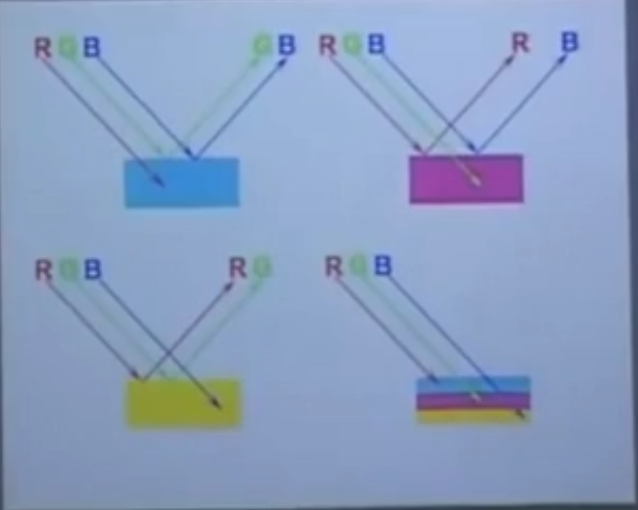

- [1.色彩](#1%E8%89%B2%E5%BD%A9)
    - [1.1.三原色](#11%E4%B8%89%E5%8E%9F%E8%89%B2)
        - [1.1.1.`HSB` ~ 基于人眼](#111hsb--%E5%9F%BA%E4%BA%8E%E4%BA%BA%E7%9C%BC)
        - [1.1.2.`RGB` ~ 光的三原色](#112rgb--%E5%85%89%E7%9A%84%E4%B8%89%E5%8E%9F%E8%89%B2)
        - [1.1.3.`CMYK` ~ 印刷色](#113cmyk--%E5%8D%B0%E5%88%B7%E8%89%B2)
        - [1.1.4. `LAB` ~ 大自然](#114-lab--%E5%A4%A7%E8%87%AA%E7%84%B6)
        - [扩展：做印刷文档时，`RGB`与`CMYK`转换](#%E6%89%A9%E5%B1%95%EF%BC%9A%E5%81%9A%E5%8D%B0%E5%88%B7%E6%96%87%E6%A1%A3%E6%97%B6%EF%BC%8Crgb%E4%B8%8Ecmyk%E8%BD%AC%E6%8D%A2)
    - [1.2.分辨率](#12%E5%88%86%E8%BE%A8%E7%8E%87)
        - [1.2.1 图片分辨率](#121-%E5%9B%BE%E7%89%87%E5%88%86%E8%BE%A8%E7%8E%87)
        - [1.2.2 改变分辨率](#122-%E6%94%B9%E5%8F%98%E5%88%86%E8%BE%A8%E7%8E%87)
    - [1.3 绘画与修饰工具](#13-%E7%BB%98%E7%94%BB%E4%B8%8E%E4%BF%AE%E9%A5%B0%E5%B7%A5%E5%85%B7)

# 1.色彩

## 1.1.三原色

### 1.1.1.`HSB` ~ 基于人眼

色相 `H`

饱和度 `S`

亮度 `B`

###  1.1.2.`RGB` ~ 光的三原色

`red`：`255. 0. 0`

`green`：`0. 255. 0`

`blue`：`0. 0. 255`

`white`：`255. 255. 255`

`black`：`0. 0. 0`

`中性灰`：`128. 128. 128`（当所有数值一样，无色相，灰度，深灰浅灰区别）

### 1.1.3.`CMYK` ~ 印刷色

青`（c） `, 按 `%` 划分，

品红`（M）`

黄`（Y）`

配不出`100%`的黑，另配黑（K）色燃料

`黑色`：`C:0 M:0 Y:0 K:100%`

`RGB`为加色模式：

`R+G=Y`

`R+B=M`

`G+B=C`

`R+G+B=WHITE`

`当红光照在白墙上，墙会变红`

`当绿灯照在白墙上，墙会变绿`

`当蓝灯照在白墙上，墙会变蓝`

`当红光和绿光交集照在白墙上，交集处会变成黄色`

`当红光和蓝光交集照在白墙上，交集处会变成品红`

`当蓝光和绿光交集照在白墙上，交集处会变成青色`

`当红光和绿光、蓝光交集照在白墙上，交集处会变成白色`

`CMYK`为减色模式：

`C+Y=G`

`C+M=B`

`M+Y=R`

当有三束光（RGB）打在青色的墙上，只能看到绿（G）光和蓝（B）光
因为红色与青色互为补色（补色：对方完全吸收），红光不显示

当有三束光（RGB）打在品红的墙上，只能看到红（R）光和蓝（B）光
因为品红与绿色互为补色（补色：对方完全吸收），绿光不显示

当有三束光（RGB）打在黄色的墙上，只能看到红（R）光和绿（G）光
因为黄色与蓝色互为补色（补色：对方完全吸收），蓝光不显示

当有三束光（RGB）打在青色+黄色+品红的墙上，都不显示

### 1.1.4. `LAB` ~ 大自然

`LAB`是理论推出来，可能不存在，其颜色之多 就像大自然中的颜色

---

### 扩展：做印刷文档时，`RGB`与`CMYK`转换

1. 新建文档，RGB模式，分辨率300PPI

2. 设置勾选`工作中的 CMYK 预览`
    - **溢色**：颜色可看，无法印刷出来
    - 在`RGB`模式下工作，用`CMYK`模式去预览，打印时就不会出现溢色现象

3. 识色时要避免选用 **溢色**（如红色：255.0.0等），会有`!`提醒

4. 完成后转`CMYK`模式出片。

但很多工作会直接新建文档CMYK模式，eg:300PPI

---

## 1.2.分辨率

###  1.2.1  图片分辨率

单位每英寸中所包含的像素点数

单位：

1. DPI:点每英寸--输出设备上每英寸可产生的点数
 
2. LPI:线每英寸--丝网印刷中线每英寸，150LP指每英寸加有150条网线
   
3. PPI:像素每英寸--电脑显示领域
   
4. 印刷分辨率300PPI
   
5. 网页分辨率72PPI
    
6.  大型喷绘15-45PPI

7.  大型喷绘-10米左右：擎天柱-围挡
    中型喷绘-5米左右:公交广告-站牌-候车厅
    小型喷绘-3米左右：易拉宝-X展架
    易拉宝：80mm*200mm
    X展架：60mm*160mm

###   1.2.2  改变分辨率
72ppi变成300ppi，，

1.邻近模式:线框越简单，此方法好
例如4、6之间取差值，取平均数，左右计算

2.两次线性：左右、上下计算

3.两次立方：颜色越复杂，此方法好，
左右、上下、左上方、右上方、左下方、右下方计算

4.色彩信息不损失下，牺牲图像大小来改变分辨率

##  1.3 绘画与修饰工具

1. 移动工具--移动图层或者组
   
2. 选区工具-矩形-椭圆-单行-单列
   
3. 套索工具-套索-多边形套索-磁性套索
   
4. 快速选择工具-魔棒工具
   
5. 裁切工具-透视裁剪-切片工具-切片选择
   
6. 吸管工具-颜色取样器-标尺工具-注释工具-计数工具
   
7. 修复工具-污点修复画笔工具-修复画笔工具-修补工具-内容感知移动工具-红眼工具
   
8. 画笔工具-铅笔工具-颜色替换工具-混合器画笔工具
   
9.  仿制图章工具-图案图章工具
    
10. 历史记录画笔-历史记录艺术画笔
    
11. 橡皮擦工具-背景橡皮擦工具-魔术橡皮擦
    
12. 渐变工具-油漆桶工具-3D材质拖放工具
    - 渐变类型（渐变默认从前景色渐变到后景色）
        1. 线性渐变
        2. 径向渐变
        3. 角度渐变
        4. 对称渐变
        5. 菱形渐变

13. 模糊工具-锐化工具（建议用液化）-涂抹工具

14

